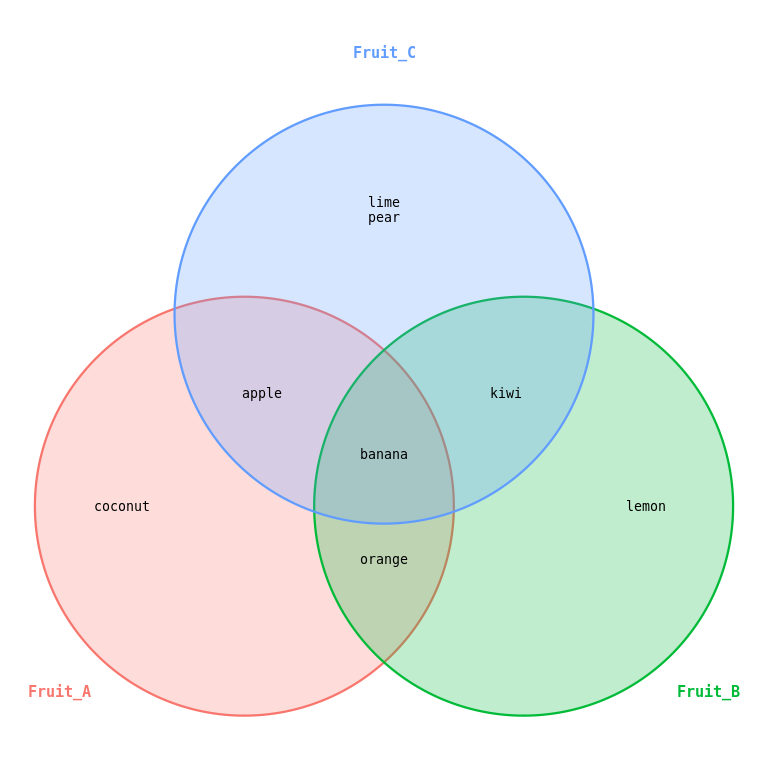
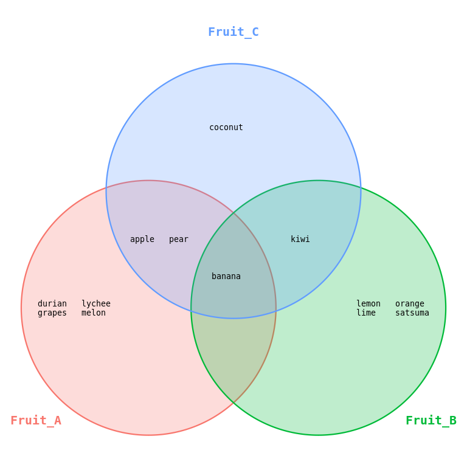
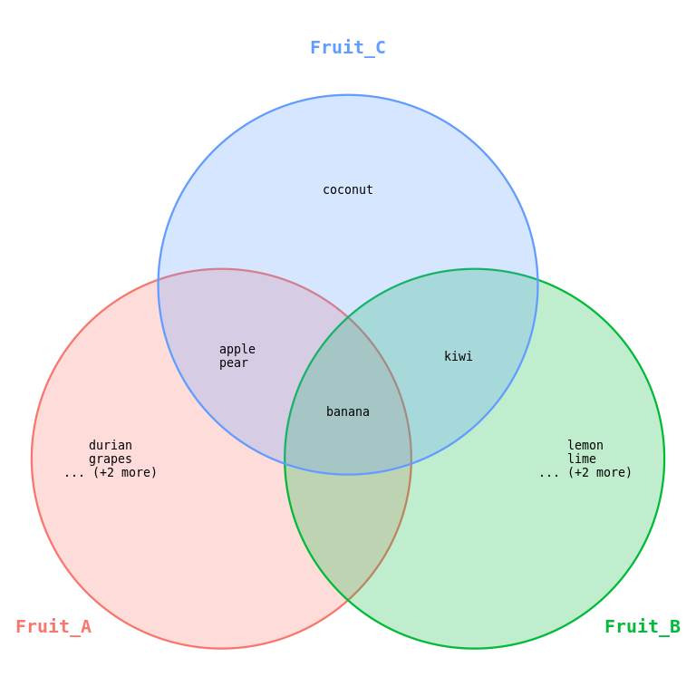

<!-- README.md is generated from README.Rmd. Please edit that file -->

# VennItem

VennItem provides a simple interface to generate Venn diagrams from two
or three sets, listing the overlapping items as lists in the appropriate
sections. The lists can be split into columns or shorterned for large
sets and the plot is generated using ggplot allowing further
customisations.

## Installation

You can install the development version of VennItem from
[GitHub](https://github.com/) with:

``` r
# install.packages("pak")
pak::pak("microbialman/VennItem")
```

## Examples

Basic example showing two small sets.

``` r
library(VennItem)
sets <- list(Fruit_A = c("apple","banana","coconut","orange"), Fruit_B = c("banana","kiwi","lemon","orange"), Fruit_C = c("banana","kiwi","apple","pear","lime"))
vennItem(sets, set_label_size = 4)
```



Example of larger sets showing column formatting ability.

``` r

big_sets <- list(Fruit_A = c("apple","banana","durian","lychee","grapes","pear","melon"),
 Fruit_B = c("banana","kiwi","satsuma","orange","lemon","lime"),
 Fruit_C = c("banana","kiwi","apple","pear","coconut"))

vennItem(big_sets, ncol_items = 2)
```



Example of larger sets showing shortening.

``` r

big_sets <- list(Fruit_A = c("apple","banana","durian","lychee","grapes","pear","melon"),
 Fruit_B = c("banana","kiwi","satsuma","orange","lemon","lime"),
 Fruit_C = c("banana","kiwi","apple","pear","coconut"))

vennItem(big_sets, max_items_per_region = 2)
```


